# Galeri Dokumentasi Visual

Seluruh gambar diambil langsung dari Buku Capstone Design (diekstrak otomatis dari PDF).
Kalau ada gambar yang tertukar/kurang pas dengan captionnya (wajar, ekstraksi dilakukan otomatis
per-halaman), tinggal ganti file-nya dengan foto/screenshot aslimu — nama file & struktur foldernya
sudah dibuat mengikuti pengelompokan berikut.

## 1. Hardware & Prototipe

| | |
|---|---|
|  Raspberry Pi 4 Model B | 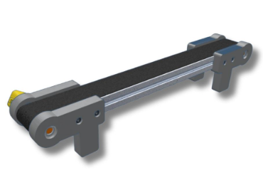 Kamera / Load Cell |
|  PCB LED / MOSFET Candling | 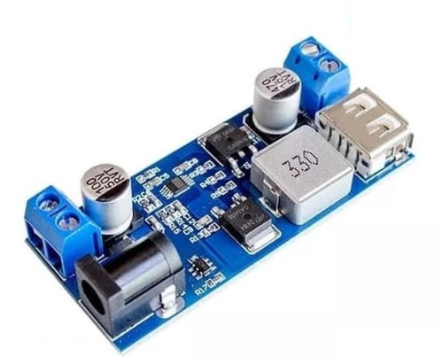 Mini Conveyor / LCD 4.3" |

**Prototipe alat lengkap:**

## 2. Diagram Sistem

| Hardware Block Diagram | Wiring Diagram |
|---|---|
|  | 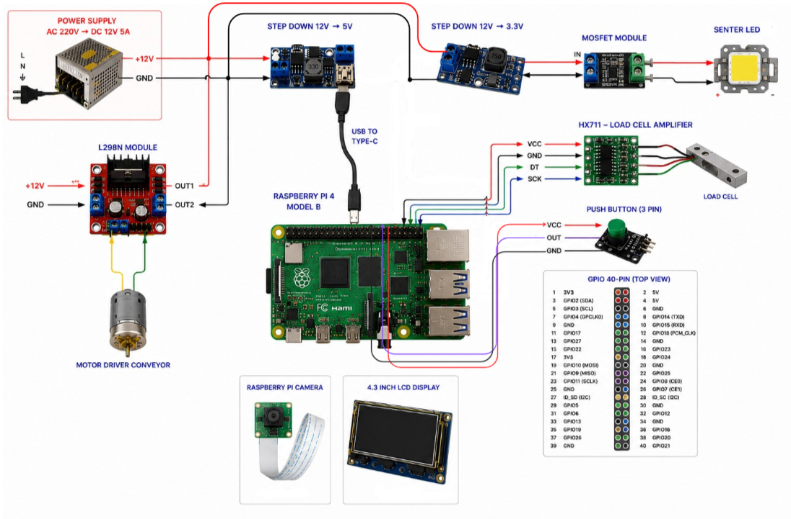 |

| Flowchart Sistem | Flowchart Model ML |
|---|---|
|  |  |

## 3. Dashboard Web

Desain awal (mockup) halaman Data Telur:

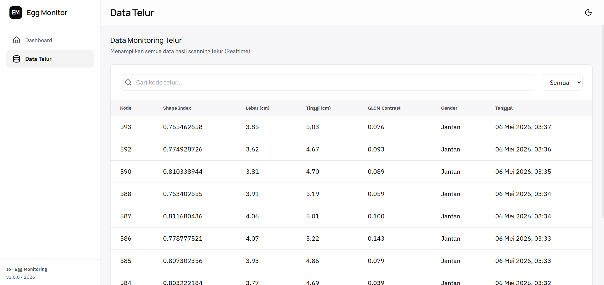

Hasil implementasi:

| Tabel Data Telur | Card Data Terbaru |
|---|---|
| 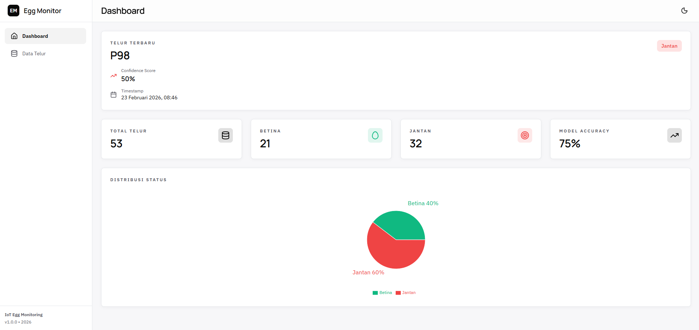 | 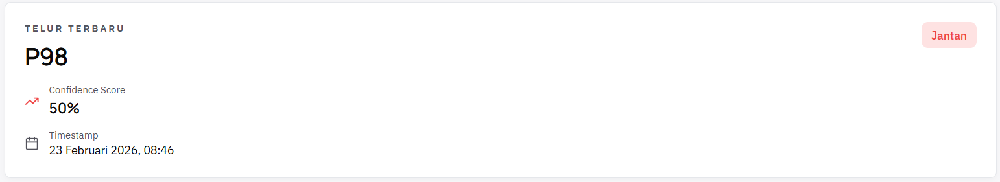 |

| Statistik | Pie Chart Gender |
|---|---|
| 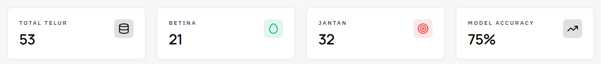 | 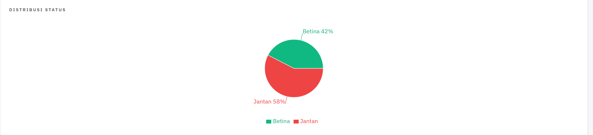 |

**Grouped bar chart — distribusi fitur top berdasarkan gender:**

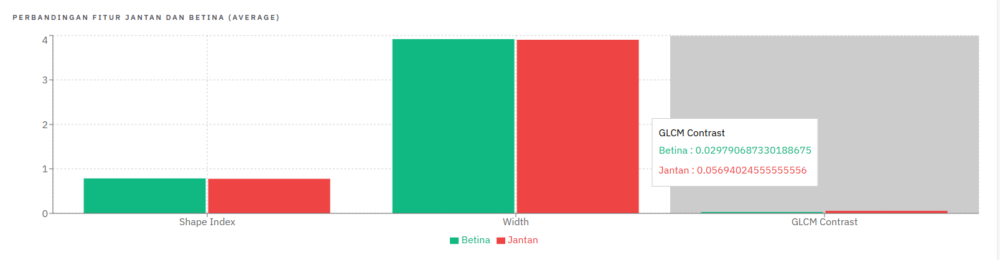

## 4. Proses Validasi Dataset (Ground Truth)

Alur pelacakan telur individual dari akuisisi data → penetasan → sexing DOC, untuk memastikan label
jenis kelamin pada dataset sesuai kondisi nyata:

| Labeling Telur | Akuisisi Data (Candling) |
|---|---|
| 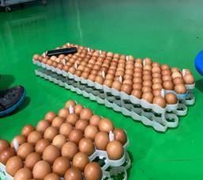 | 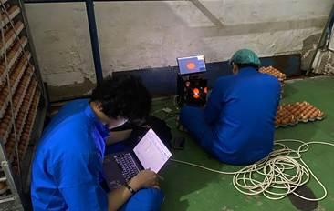 |

| Candling Hari ke-19 | Basket Penetasan + Sekat |
|---|---|
| 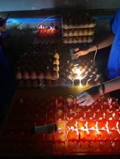 | 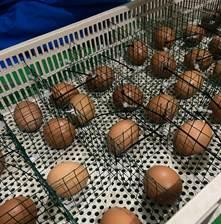 |

**Proses Sexing DOC (pencocokan hasil dengan kode identifikasi telur):**

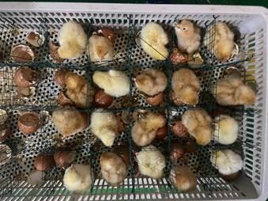

## 5. Evaluasi Model Machine Learning

**Confusion Matrix (SVM-RBF + GLCM Contrast, 50 data uji):**

- Betina: 21 aktual → 18 benar, 3 salah diprediksi jantan
- Jantan: 29 aktual → 26 benar, 3 salah diprediksi betina
- Akurasi keseluruhan: **88%**

**Feature Contribution (Permutation Importance):**

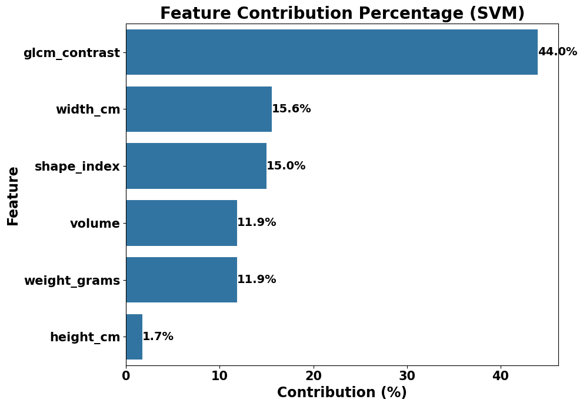

GLCM Contrast mendominasi kontribusi (44%) — lihat rincian di [`model_results.md`](model_results.md).
