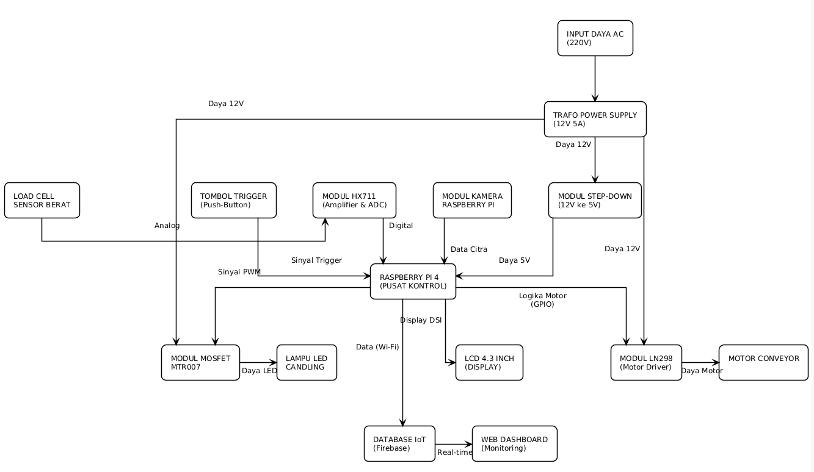
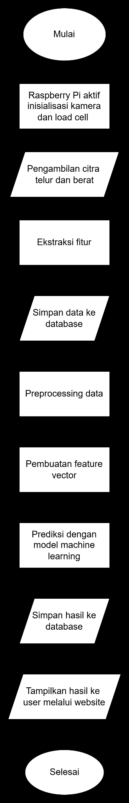
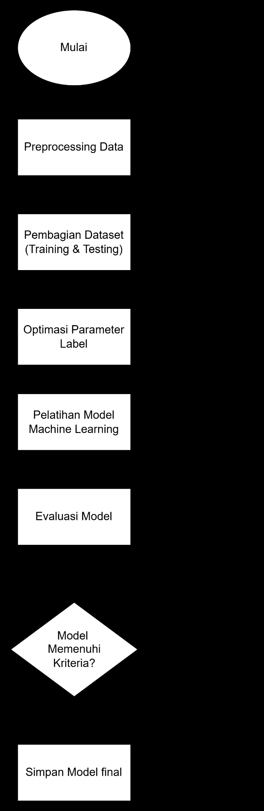
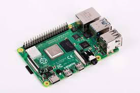
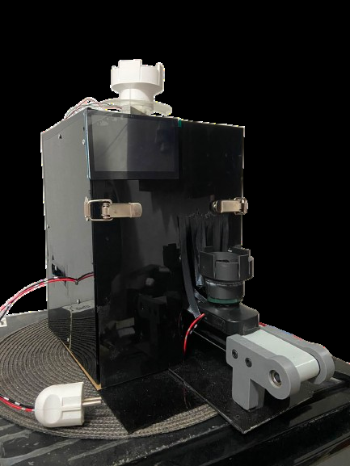
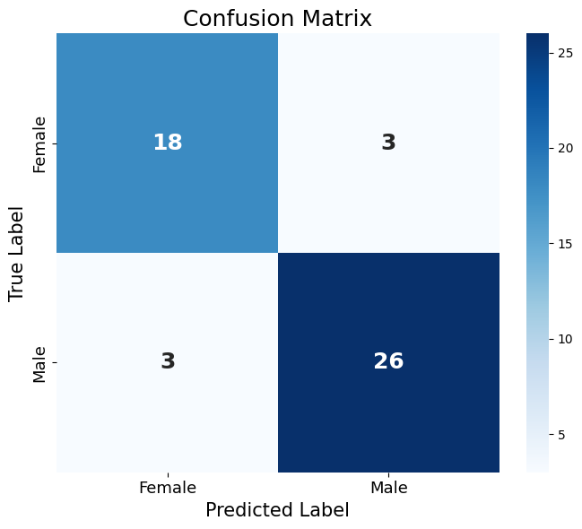

# 🥚 In-Ovo Sex Detection of Laying Hen Eggs

**A Raspberry Pi, Computer Vision & Machine Learning (SVM) system for non-invasive egg sexing in layer chickens**

Capstone Design — B.Eng. in Computer Engineering, School of Electrical Engineering, Telkom University (2026)

> A non-destructive, non-invasive system that predicts the sex of ISA Brown layer chicken embryos on day 0 of incubation, using candling imagery, a 13-feature morphological/physical/textural pipeline, and an RBF-kernel SVM classifier — achieving **88% accuracy**, **89.65% F1-score**, and **94.74% ROC-AUC** on held-out, hatch-verified test data.

## 🤝 Research Collaboration

This project was carried out in partnership with Indonesia's **National Research and Innovation Agency (BRIN)** and the **Hatchery of PT Super Unggas Jaya (PT SUJA), Cirebon**. System requirements were derived directly from interviews with BRIN researchers/technicians and PT SUJA hatchery staff. Dataset collection (250 eggs), field testing, and ground-truth validation (hatching → DOC sexing) were all conducted on-site at the PT SUJA hatchery in Cirebon (April 5–30, 2026).

## 📌 Background

The layer chicken industry faces a persistent problem: male day-old chicks (DOCs) have no economic value for egg production and are routinely culled shortly after hatching, causing both economic loss and animal-welfare concerns. This project tackles that problem with an **in-ovo sexing** system — one that can predict an egg's sex *before it hatches*, without piercing or damaging the shell, so male eggs can be identified and removed from the incubation pipeline early.

## 🧠 System Pipeline

1. An egg is placed on a **load cell (HX711)** → weight is measured
2. The operator presses a **push button** → the egg moves onto a **mini conveyor (L298N)**
3. A **candling LED (MOSFET MTR-0037)** turns on → the **Raspberry Pi camera** captures the image
4. The image is processed: HSV segmentation → ellipse fitting → extraction of 10 base features (height, width, shape index, ovality, eccentricity, surface area, volume, density, weight, GLCM contrast) + 3 engineered ratio features
5. The 13-feature vector is classified by an **SVM (RBF kernel)** → sex prediction (male/female) + confidence score
6. The result is pushed to **Firebase Realtime Database** (with a local CSV backup for offline resilience)
7. A **React web dashboard** displays results in real time

### Hardware Block Diagram



### Wiring Diagram


### System & ML Flowcharts

<table>
<tr>
<td></td>
<td></td>
</tr>
</table>

## 📷 Hardware & Prototype

<table>
<tr>
<td><br/><sub>Raspberry Pi 4B</sub></td>
<td><br/><sub>Camera / Load Cell</sub></td>
<td><br/><sub>Conveyor / LCD</sub></td>
<td><br/><sub>Full Prototype</sub></td>
</tr>
</table>

Full gallery (every component + dataset validation process): [`docs/gallery.md`](docs/gallery.md)

## 🖥️ Web Dashboard

<table>
<tr>
<td colspan="2"><br/><sub>Egg data table (real-time)</sub></td>
</tr>
<tr>
<td><br/><sub>Summary stats</sub></td>
<td><br/><sub>Gender distribution</sub></td>
</tr>
</table>

Built with **React + Vite**, wired to **Firebase Realtime Database** (anonymous auth for read access; write access is restricted to the Raspberry Pi via the Admin SDK).

## 🏗️ Repository Structure

```
egg-sexing-capstone/
├── hardware/            # 🟢 ORIGINAL code from the Raspberry Pi
│   ├── main.py          #    Main program (load cell → candling → ML inference → Firebase)
│   ├── hx711.py         #    Load cell driver
│   ├── calibrate.py     #    Load cell calibration script
│   └── tests/           #    Standalone component tests (motor, LED, button)
├── ml/                  # Feature extraction, preprocessing, SVM training & evaluation
├── dashboard/           # React + Firebase web dashboard (reconstructed from the thesis book)
├── firebase/            # Security rules & example credentials
├── docs/                # Diagrams, wiring reference, formulas, test results, photo gallery
└── data/                # Dataset (not included — see data/README.md)
```

> 🟢 = original code proven to run on the physical device. See [`docs/CONTRIBUTING_NOTES.md`](docs/CONTRIBUTING_NOTES.md) for the exact status of every part of this repo.

## ⚙️ Hardware

| Component | Function | GPIO |
|---|---|---|
| Raspberry Pi 4 Model B | Edge computing / main controller | — |
| Raspberry Pi Camera 5MP | Candling image acquisition | CSI |
| Load Cell + HX711 | Egg weight measurement | GPIO 5, 6 |
| 800-lumen candling LED + MOSFET MTR-0037 | Candling light source | GPIO 18 |
| Mini conveyor + L298N motor driver | Automatic egg transport | GPIO 13, 20, 16 |
| Push button | Process trigger | GPIO 19 |
| 4.3" LCD | Device status display | DSI |

Full wiring & GPIO reference: [`docs/hardware_wiring.md`](docs/hardware_wiring.md) · Setup & run instructions: [`hardware/README.md`](hardware/README.md)

## 🤖 Machine Learning

- **13 features:** `height_cm`, `width_cm`, `shape_index`, `ovality`, `eccentricity`, `surface_area`, `volume`, `density`, `weight_grams`, `glcm_contrast`, plus 3 engineered ratios (`height_width_ratio`, `volume_surface_ratio`, `density_ratio`)
- **Model:** SVM with RBF kernel (`C=100`, `gamma=0.01`), tuned via 5-fold Grid Search CV (F1-scoring)
- **Dataset:** 250 eggs collected at the PT SUJA hatchery, ground-truthed via hatching + DOC sexing
- **Model comparison:** SVM outperforms both KNN and LightGBM on every metric

| Model | Accuracy | Precision | Recall | F1-Score | ROC-AUC |
|---|---|---|---|---|---|
| KNN | 80.00% | 85.18% | 79.31% | 82.14% | 88.50% |
| LightGBM | 80.00% | 82.75% | 82.75% | 82.75% | 90.14% |
| **SVM (final)** | **88.00%** | **89.65%** | **89.65%** | **89.65%** | **94.74%** |

### Confusion Matrix



| | Predicted Female | Predicted Male |
|---|---|---|
| **Actual Female** (21) | 18 ✅ | 3 ❌ |
| **Actual Male** (29) | 3 ❌ | 26 ✅ |

### Feature Contribution (Permutation Importance)


GLCM Contrast (the texture feature) dominates with a **44%** contribution — well above any morphological or physical feature. Adding GLCM Contrast to the model raises accuracy from 56% to 88% (a +32 percentage-point jump), which suggests that internal egg texture visible under candling carries more sex-discriminative signal than shape or size alone.

📊 Full metrics (GLCM Contrast ablation, response time, power draw, uptime): [`docs/model_results.md`](docs/model_results.md)
🧮 Feature formulas (shape index, ovality, eccentricity, volume, GLCM contrast): [`docs/formulas.md`](docs/formulas.md)
📷 Photo gallery — hardware, dashboard, and the dataset validation process: [`docs/gallery.md`](docs/gallery.md)

## 🚀 Getting Started

### Hardware (Raspberry Pi)
```bash
cd hardware
pip install -r requirements.txt --break-system-packages
python calibrate.py    # calibrate the load cell once, up front
python main.py         # run the main system
```
Full setup details (required credential files, button sequence, etc.): [`hardware/README.md`](hardware/README.md)

### Train the ML Model
```bash
cd ml
pip install -r requirements.txt
python train.py --csv ../data/dataset_telur.csv --out models/egg_gender_model.pkl
```
Then copy `models/egg_gender_model.pkl` to `hardware/egg_gender_model.pkl` on the Raspberry Pi.

### Dashboard
```bash
cd dashboard
npm install
npm run dev
```

**Supervisors:** Dr. Meta Kallista, S.Si., M.Si. · Dr. Ig. Prasetya Dwi Wibawa, S.T., M.T.
**Research Partners:** National Research and Innovation Agency (BRIN) · Hatchery of PT Super Unggas Jaya, Cirebon

## 📄 Project Status

The hardware code (`hardware/`) is **original code**, proven to run on the physical device. The
dashboard is still reconstructed from the thesis book, and the trained model / raw dataset are not
included since the data belongs to the research partners. Full breakdown:
[`docs/CONTRIBUTING_NOTES.md`](docs/CONTRIBUTING_NOTES.md).

## 📜 License

See [`LICENSE`](LICENSE).
